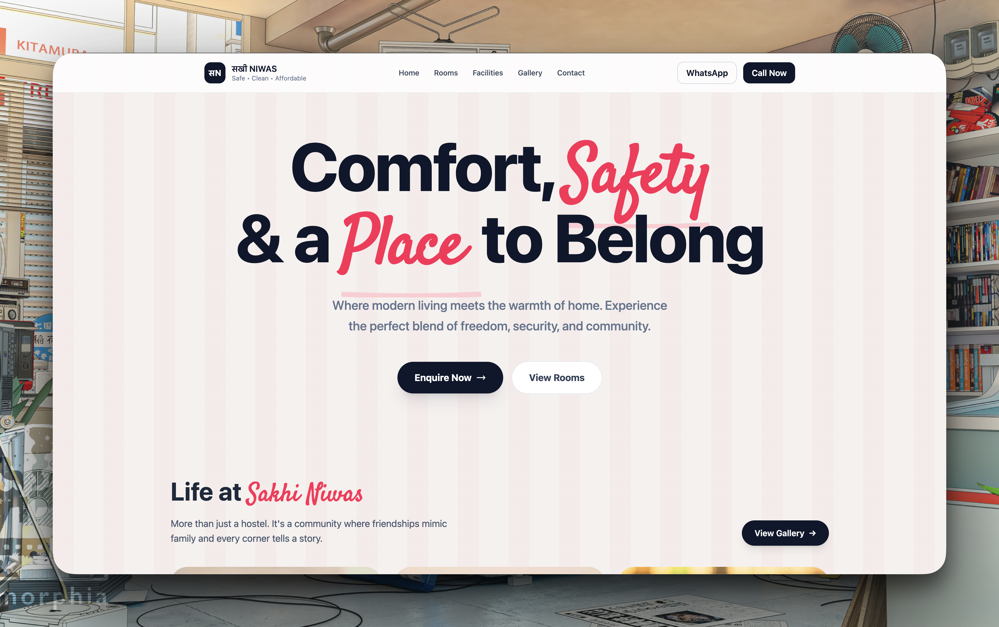
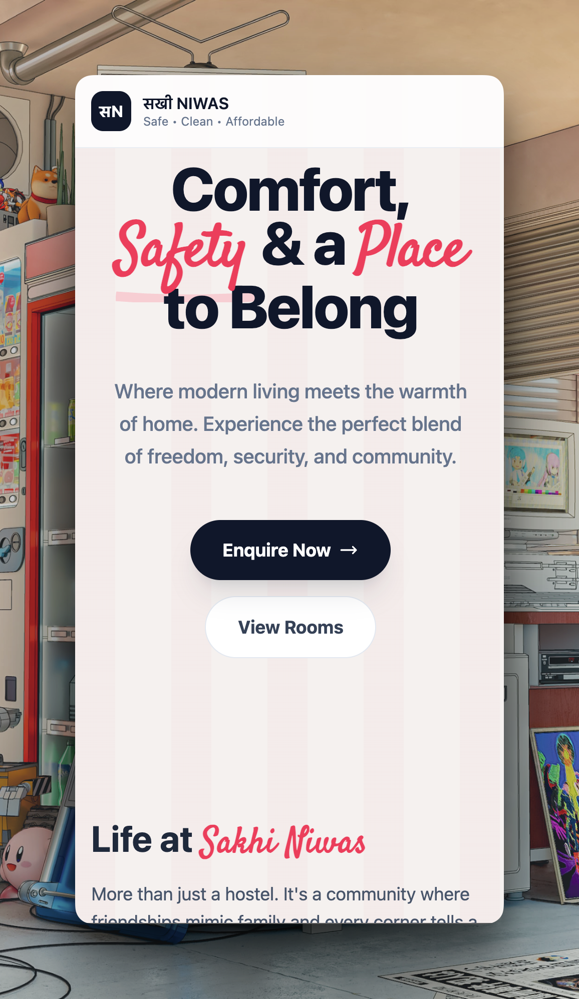

# 🏠 Sakhi Niwas Hostel Website

> An independently developed responsive hostel website exploring modern UI design, Tailwind CSS, CSS-driven animations, serverless form handling, and performance-focused frontend development.

[](https://sakhiniwas-portal.vercel.app/)
[](LICENSE)
[](https://developer.mozilla.org/en-US/docs/Web/HTML)
[](https://tailwindcss.com/)
[](https://lottiefiles.com/)
[](https://formspree.io/)

🔗 **Live Demo:** [sakhiniwas-portal.vercel.app](https://sakhiniwas-portal.vercel.app/)

---

## Overview

Sakhi Niwas is an independently developed frontend project designed around a modern hostel and accommodation experience for students and working professionals.

The project focuses on creating a polished, responsive interface without relying on a JavaScript UI framework.

It combines semantic HTML, Tailwind CSS, CSS animations, Lottie illustrations, responsive layouts, and serverless form handling to create an interactive experience while keeping the frontend architecture lightweight.

The project was built as a personal exercise in responsive design, CSS architecture, animation systems, accessibility-conscious UI patterns, and third-party service integration.

---

## 📸 Preview

| Home Page | Features & Facilities |
|:---:|:---:|
|  |  |

---

## ✨ Core Features

### 🏠 Responsive Hostel Experience

- Responsive desktop, tablet, and mobile layouts
- Modern accommodation-focused visual design
- Structured sections for facilities and services
- Responsive navigation and content layouts
- Mobile-first layout considerations

### ✨ CSS-Driven Animations

- Infinite testimonial marquee
- Custom CSS keyframes
- Ambient glow effects
- Hover interactions
- Smooth transitions
- Faded marquee edges using CSS masking

The testimonial marquee is implemented primarily through CSS animation rather than continuous JavaScript updates.

### 🎨 Modern UI Design

- Tailwind CSS utility architecture
- Glassmorphism-inspired components
- Background blur effects
- Ambient lighting and glow effects
- Custom responsive layouts
- Masonry-style content arrangements
- Lottie-based visual elements

### 📩 Serverless Contact Handling

The inquiry/contact functionality uses Formspree to handle form submissions without requiring a dedicated backend.

This keeps the project lightweight while still providing a functional inquiry workflow.

---

## 🏗️ Frontend Architecture

The project deliberately avoids a frontend JavaScript framework and instead uses browser-native technologies with Tailwind CSS.

```text
                         ┌─────────────────────┐
                         │       Browser       │
                         └──────────┬──────────┘
                                    │
                                    ▼
                         ┌─────────────────────┐
                         │       HTML5         │
                         │  Semantic Structure │
                         └──────────┬──────────┘
                                    │
                                    ▼
                         ┌─────────────────────┐
                         │    Tailwind CSS     │
                         │                     │
                         │ Layout              │
                         │ Responsive Design   │
                         │ Components          │
                         │ Animations          │
                         └──────────┬──────────┘
                                    │
                    ┌───────────────┼────────────────┐
                    │               │                │
                    ▼               ▼                ▼
             ┌───────────┐   ┌────────────┐   ┌─────────────┐
             │  Lottie   │   │ Formspree  │   │ CSS Engine  │
             │ Animation │   │   Forms    │   │ Animations  │
             └───────────┘   └────────────┘   └─────────────┘
```

---

## 🔄 Inquiry Flow

The contact functionality is handled through a serverless form provider rather than a custom backend.

```text
User
  │
  ▼
Inquiry Form
  │
  ▼
Formspree
  │
  ▼
Submission Processing
  │
  ▼
Configured Recipient
```

This approach avoids maintaining a dedicated backend for a simple contact and inquiry use case.

---

## 🎞️ Animation Architecture

A major focus of the project was creating visually rich interactions without continuously running JavaScript animation loops.

### Infinite Marquee

The testimonial section uses CSS keyframes to continuously translate content across the viewport.

The animation combines CSS transforms, keyframe timing, duplicated content, and masking techniques to create a continuous scrolling effect with faded edges.

### Why CSS Instead of JavaScript?

CSS animations are well suited for deterministic visual motion such as:

- Marquees
- Decorative transitions
- Hover effects
- Ambient movement

This keeps animation logic out of the JavaScript runtime and simplifies the implementation.

---

## 🎨 Design System

The visual system is built around Tailwind CSS utilities and reusable styling patterns.

### Visual Techniques

- Glassmorphism
- Backdrop blur
- Ambient glow effects
- Gradient backgrounds
- Responsive grids
- Masonry-inspired layouts
- CSS masking
- Smooth transitions

### Motion

- Infinite marquees
- Hover transitions
- Entrance effects
- Interactive facility animations
- Lottie illustrations

The goal was to create a premium accommodation interface while keeping the implementation lightweight and responsive.

---

## 🛠️ Tech Stack

### Frontend

- **HTML5** — semantic page structure
- **Tailwind CSS** — utility-first styling and responsive layouts
- **CSS3** — animations, keyframes, masks, transitions, and custom styling

### Integrations

- **LottieFiles** — lightweight animated illustrations
- **Formspree** — serverless contact and inquiry handling

### Development

- **Tailwind CLI**
- **npm**
- **Git**
- **GitHub**
- **VS Code**

### Deployment

- **Vercel**

---

## 📁 Project Structure

```text
sakhiniwas-portal/
│
├── screenshots/
│   ├── home.png
│   └── mobile.png
│
├── src/
│   └── ...
│
├── public/
│   └── ...
│
├── index.html
├── package.json
├── tailwind.config.*
├── postcss.config.*
├── LICENSE
└── README.md
```

---

## 📦 Installation & Setup

### Prerequisites

- Node.js
- npm
- Git

### 1. Clone the repository

    git clone https://github.com/hritikbytes/sakhiniwas-portal.git
    cd sakhiniwas-portal

### 2. Install dependencies

    npm install

### 3. Start the development environment

    npm run dev

The exact development command depends on the scripts configured in `package.json`.

### 4. Build for production

    npm run build

---

## 💡 Technical Challenges & Learning

### 1. Building a Rich UI Without React

One of the main goals of this project was creating a modern, highly interactive interface without depending on a component framework.

This required a stronger understanding of:

- Semantic HTML
- CSS layout systems
- Tailwind utility composition
- CSS variables
- Responsive breakpoints
- DOM behaviour
- CSS animation

The project demonstrates that a polished interface does not necessarily require a JavaScript framework.

### 2. CSS-Only Infinite Marquee

The testimonial carousel was implemented using CSS animation rather than JavaScript timers.

The challenge was creating a continuous visual loop without noticeable jumps at the end of the animation cycle.

CSS transforms, duplicated content, keyframe timing, and masking were combined to create the effect.

### 3. Responsive Masonry-Style Layouts

The page uses content-heavy sections that need to maintain visual hierarchy across significantly different screen widths.

Responsive CSS layouts were used to change positioning, spacing, sizing, and content flow across breakpoints rather than treating mobile as a scaled-down desktop version.

### 4. Serverless Form Integration

Rather than introducing a custom backend for a relatively simple inquiry form, Formspree was used as a serverless form-handling layer.

This reduced application complexity while keeping the form functional.

---

## ⚡ Performance Considerations

The project focuses on keeping the frontend lightweight by:

- Using CSS for deterministic animations
- Avoiding a large frontend framework
- Using responsive CSS layouts
- Keeping JavaScript requirements minimal
- Using external services only where they provide clear value
- Avoiding unnecessary client-side animation loops

---

## ♿ Responsive & Accessibility Considerations

The interface was designed with responsive behaviour across desktop and mobile viewports.

Key considerations include:

- Semantic HTML structure
- Responsive typography
- Mobile-friendly spacing
- Touch-friendly interactive elements
- Responsive navigation
- Visual hierarchy across breakpoints

Accessibility can be further improved through expanded keyboard navigation, contrast auditing, and automated accessibility testing.

---

## 🛣️ Future Improvements

- [ ] Add light/dark theme support
- [ ] Add interactive location/map section
- [ ] Add room availability and booking workflow
- [ ] Add backend-driven inquiry management
- [ ] Add form validation and improved feedback states
- [ ] Add automated accessibility testing
- [ ] Add performance monitoring
- [ ] Improve SEO metadata and structured data
- [ ] Add automated frontend testing

These represent potential future improvements rather than functionality currently implemented.

---

## 📊 Project Status

**Status:** Personal project / deployed demo

Sakhi Niwas is an independently developed frontend project created to explore responsive web design, Tailwind CSS, CSS animation systems, third-party integrations, and lightweight frontend architecture.

The application is deployed on Vercel for demonstration purposes.

---

## 👨‍💻 Developer

**Hritik Sharma**

Web Developer focused on React, Next.js, TypeScript, and modern full-stack web development.

- **GitHub:** [@hritikbytes](https://github.com/hritikbytes)
- **LinkedIn:** [linkedin.com/in/hritiksharma0608](https://linkedin.com/in/hritiksharma0608/)
- **Email:** [hritiksharma.0608@gmail.com](mailto:hritiksharma.0608@gmail.com)

---

<div align="center">

**Built independently by Hritik Sharma**

[Live Demo](https://sakhiniwas-portal.vercel.app/)

</div>
